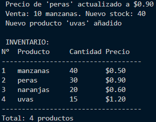
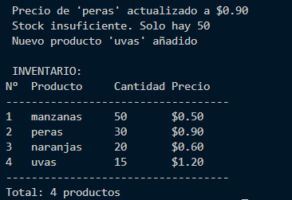
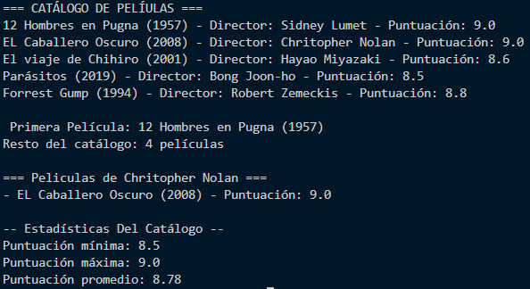
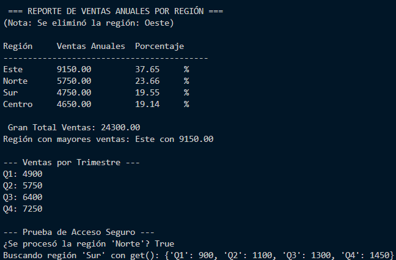
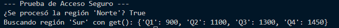
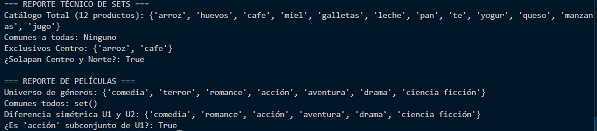
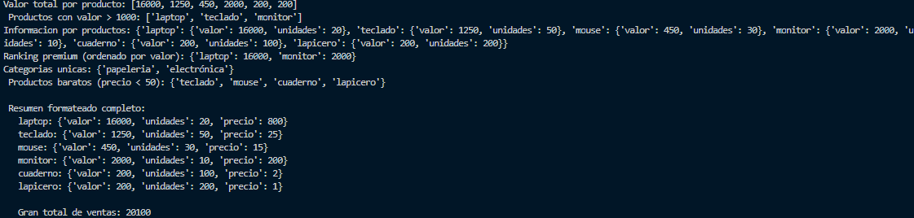

# Trabajo GA1 220501093-04 AA1 EV03 – Fundamentos de Python: Estructuras de Datos en Python

## Reto Módulo 1: Listas – Sistema de inventario

### Descripción del reto
Construir un sistema de inventario usando listas anidadas que gestione productos, precios y stock. Se implementan funciones para actualizar precio, registrar ventas, añadir productos y mostrar el inventario.

### Solución implementada
El código se encuentra en `modulo1_listas/inventario_listas.py`. Se utilizaron exclusivamente los subtemas proporcionados:
- **Creación y Acceso**: listas con `[]`, índices, `len()`.
- **Métodos para añadir**: `append()`, `insert()`.
- **Métodos para eliminar**: `del lista[i]`.
- **Recorrido de listas**: `enumerate()`.

No se usó modificación directa (`lista[i] = valor`) porque no aparece en los subtemas; en su lugar, se aplica `del` + `insert` para actualizar valores.

### Evidencia de ejecución

Se puede ver la actualizacion del precio de las peras que estaban en 0.75 a 0.90 usando del y tambien insert. Despues se registro una venta de 10 manzanas se aplica del para eliminar la sublista original y insert para poder colocar la nueva con stock 40. Despues se añade un nuevo producto que son las uvas usando append(). Por ultimo mostrar_inventario() recorre la lista con enumerate() y muestra los datos usando indices y len().

En esta imagen se ve que se intento vender 100 manzanas pero solo hay 50. La funcion registrar_venta() hace que verifique la condicion item[1] >= cantidad y al ser falsa muestra el mensaje de error sin modificar el inventario. Se pudo ver que se uso la estructura de condicionales y tambien con el acceso de elementos de la lista anidada.

### Reflexión personal

Haciendo este reto entendi lo importante de los subtemas que se vieron en la pagina. Como las listas no estan modificadas por indice, aprendi a usar el del y el insert. Tambien entendi como usar enummerte() para poder recorrer 

## Reto Módulo 2: Tuplas – Sistema de películas

### Descripción del reto
Construir un catálogo de películas usando tuplas inmutables. Se debe recorrer el catálogo con desempaquetado, usar el operador `*` para separar la primera película, implementar búsqueda por director y calcular estadísticas (mínimo, máximo, promedio) sin usar `min`, `max` ni `sum`, solo con bucles y `len()`.

### Solución implementada
El código se encuentra en `modulo2_tuplas/catalogo_peliculas.py`. Se utilizaron exclusivamente los subtemas proporcionados:
- **Creación de tuplas**: `()` y comas, tupla vacía, tupla de tuplas.
- **Acceso a elementos**: índices, `len()`.
- **Desempaquetado básico y operador `*`**: `primera, *resto = catalogo`.
- **Desempaquetado en bucle `for`**: `for titulo, director, año, punt in catalogo`.
- **Retorno múltiple de funciones** y desempaquetado de resultados.
- **Recorrido y acumulación** en nueva tupla mediante concatenación (sin mutar las originales).

Se puede ver el uso de una  **tupla de tuplas** (`catalogo`) creada con paréntesisy comas. El recorrido se hizo con un bucle con el for que hace que se **desempaqueta** cada subtupla en cuatro variables: título, director, año y puntuacion. Despues se uso el **operador`*`** para poder separar la primera pelicula del resto, haciendo que se muestren cuantas peliculas quedan. La función `buscar_por_director()` recorre el catálogo, compara el director y acumula las coincidencias en una nueva tupla (usando concatenación `+=`). Por ultimo, `obtener_estadisticas()` calcula el mínimo, máximo y promedio, con un bucle `for`, comparaciones manuales y `len()`. El retorno múltiple se desempaqueta en tres variables y se imprime. Todo respeta los subtemas proporcionados.*

Se cambia el director buscado a "Quentin Tarantin". La función `buscar_por_director()` devuelve una tupla vacía, cuando se ejecuta no se imprime ninguna película. Esto demuestra que el código maneja correctamente el caso de no encontrar resultados.

### Reflexión personal

Las tuplas entendí lo de la inmutabilidad que cuando se crea el catálogo, no se puede modificar por accidente. Aprendí a desempaquetar tuplas en bucles y con el operador `*`, y a retornar varios valores desde una función. También practiqué la acumulación de resultados en una nueva tupla.

## Reto Módulo 3: Diccionarios – Análisis de ventas por región

### Descripción
Se define un diccionario anidado con ventas trimestrales de cuatro regiones. Se aplican operaciones CRUD (`update`, `pop`, `setdefault`), se calculan totales anuales, región con mayores ventas, acumulados por trimestre, porcentajes de participación y se genera un reporte ordenado.

### Solucion iplementada
- **Estructura Clave-Valor**: `in`, `get()`.
- **Creación de diccionarios**: literal con llaves y anidados.
- **Operaciones CRUD**: `update()` (añadir región Centro), `pop()` (eliminar región Oeste), `setdefault()` (inicializar acumuladores de trimestre), asignación directa `d[clave] = valor`.
- **Iteración**: `items()`, `values()`, bucles anidados, `sorted()` con `key=lambda`.
- **Comprensiones de diccionario**: para calcular porcentajes.

  
Ejecución principal. Se observa el uso de `update()` para incorporar la región "Centro", `pop()` para eliminar "Oeste" (el mensaje de eliminación se muestra). Luego, mediante `items()` y `sum(values())` se calculan los totales anuales. Se usa `max` con `lambda` para la región líder. Los acumuladores por trimestre emplean `setdefault()` para inicializar cada clave de forma segura. Finalmente, una dict comprehension genera los porcentajes y `sorted()` imprime el reporte ordenado de mayor a menor.

   
Demostración de `in` para verificar existencia de una clave y `get()` para acceder sin riesgo de `KeyError`, cubriendo el subtema "Estructura Clave-Valor".

### Reflexión personal
Al modificar el código para incluir `update()`, `pop()` y `setdefault()`, comprendí cómo las operaciones CRUD en diccionarios permiten gestionar datos dinámicamente. El uso de `items()` en bucles anidados. Aprendí que `sum(values())` simplifica el cálculo de totales y que la dict comprehension es buena para transformar datos.

## Reto Módulo 4: Conjuntos – Tiendas y recomendaciones de películas

### Descripción
Se definen tres conjuntos de productos para tiendas (Centro, Norte, Sur) y tres conjuntos de géneros cinematográficos para usuarios. Se aplican operaciones de teoría de conjuntos para hallar catálogo completo, productos comunes, exclusivos y solapamientos. Además, se usan operadores matemáticos para combinar géneros y verificar subconjuntos.

### Solucion implementada
- **Elementos únicos y creación**: literales `{}`, conjunto vacío `set()`.
- **Operaciones básicas**: `add()`, `update()`, `discard()`.
- **Métodos de teoría de conjuntos**: `union()`, `intersection()`, `difference()`, `isdisjoint()`.
- **Operadores matemáticos**: `&` (intersección), `|` (unión), `-` (diferencia), `^` (diferencia simétrica), `<=` (subconjunto).

### Evidencia de ejecución
  
Ejecución completa. Se observa el catálogo total obtenido con `union()`, los productos comunes, los exclusivos de cada tienda con `difference()`, y la verificación de solapamiento con `isdisjoint()`. En la parte de películas se usan operadores matemáticos que son `&`, `|`, `-`, `^`, `<=` para calcular universo, comunes, diferencia simétrica y subconjunto.

### Reflexión personal
Aprendí que los conjuntos son ideales para eliminar duplicados automáticamente y para operaciones de comparación eficientes (O(1) en `in`). Incluir `add()`, `update()` y `discard()` me permitió comprender la mutabilidad de los sets. Los métodos `union()`, `intersection()` y `difference()` son muy legibles, mientras que los operadores (`&`, `|`, `-`, `^`) tienen una sintaxis más compacta. También entendí de como usar `set()` para conjunto vacío y no `{}`.

## Reto Módulo 5: Comprehensions – Analizador de ventas

### Descripción
Se aplican list, dict y set comprehensions sobre un dataset de 6 productos para:
- Calcular valor total por producto (list comp).
- Filtrar productos destacados (valor > 1000) con list comp.
- Generar un diccionario con información de cada producto (dict comp).
- Crear un ranking de productos premium (precio > 50) ordenado por valor (dict comp + sorted).
- Obtener categorías únicas y productos baratos (set comp con filtro).
- Mostrar resumen formateado y gran total usando `sum()`.

### Solucion implementada
- **List comprehension**: transformación (`[expr for x in it]`) y filtro (`if cond`).
- **Dict comprehension**: creación a partir de lista de dicts, con filtro y transformación de valores.
- **Set comprehension**: eliminación de duplicados y filtrado para obtener elementos únicos.
- **Funciones integradas**: `sorted()` para ordenar (necesario por el reto) y `sum()` para total.

### Evidencia de ejecución
  
Salida completa del programa. Se observan las cuatro listas resultantes, los diccionarios generados, los conjuntos únicos y el gran total. Cada resultado corresponde a una comprensión diferente, demostrando su uso práctico.

### Reflexión personal
Las comprehensions permiten escribir código muy conciso y legible para transformar y filtrar datos. Aprendí que una list comprehension con filtro reemplaza varias líneas de un bucle `for` con `append()`. Las dict comprehensions sirven para crear mapeos rapidos, y las set comprehensions eliminan duplicados automáticamente. También pude entender que para ordenar resultados es necesario combinar `sorted()` con una dict comprehension. Este reto me ayudó a integrar las tres formas de comprehensions en un caso real de análisis de ventas.